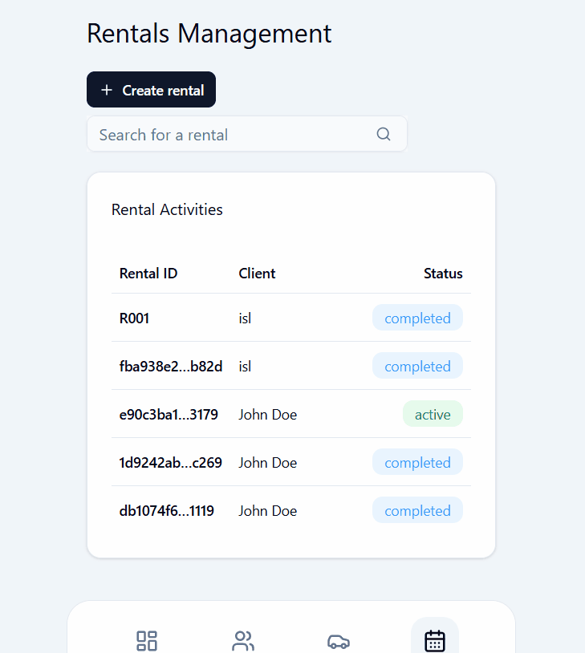
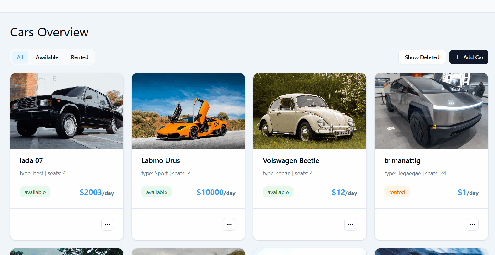

# 🚗 Car Rental Management System - Frontend

[](https://reactjs.org/)
[](https://www.typescriptlang.org/)
[](https://vitejs.dev/)
[](https://tailwindcss.com/)

A modern frontend application built with React, TypeScript, Vite, TailwindCSS, shadcn/ui, React Router, React Query, and Axios. This project serves as the UI for a car rental management system.

---

## 📌 Features

### Implemented ✅
- **Dashboard** - Fully connected to FastAPI `/dashboard` endpoint with real-time statistics
- **Cars Management** - Complete CRUD operations with image upload, filtering (all/available/rented), soft delete
- **Clients Management** - Full CRUD with form validation, soft delete
- **Rentals Management** - Full UX-friendly creation stage and details dialog  
- **Form Validation** - Zod schemas with React Hook Form
- **File Upload** - Drag-and-drop with React Dropzone
- **Testing** - Comprehensive tests with Vitest and RTL
- **Authentication** - JWT-based auth for the admin

### In Development 🚧
- **AI Assistance** - AI assistance querying most rented car, most active client,...
- **Dashboard Analytics** - Charts for revenue, statistics, and vehicle utilization

---

## 🛠️ Tech Stack

**Core:** Vite, React 18, TypeScript, TailwindCSS  
**UI:** shadcn/ui, Lucide Icons, Radix UI  
**Routing & State:** React Router v6, React Query (TanStack Query)  
**Forms:** React Hook Form, Zod, React Dropzone, use-debounce 
**API:** Axios 
**Testing:** Vitest, React Testing Library

---

## 📸 App Preview

| 📱 Mobile Flow | 🖥️ Desktop Flow |
| :---: | :---: |
|  |  | 

| 📱 Rental Workflow (Logic) | 🖥️ Car Creation (UX/Validation) |
| :---: | :---: |
|  |  |
| **Stage-based selection:** <br> Car search → Client lookup → Confirmation | **Inventory Flow:** <br> Zod validation & Drag-and-drop upload |

---

---

## 🎬 Interactive Demo
Experience the system in action without installing anything!

[](https://app.supademo.com/demo/cmjy72x390hn3gmn8p549ojq2?utm_source=link)

[](https://app.supademo.com/demo/cmjy7zeww0i33gmn8yozcmea7?utm_source=link)

---

## 🚀 Getting Started

### Prerequisites
- Node.js 18+ 
- Backend API running on `http://127.0.0.1:8000`

### Installation

```bash
# 1. Clone repository
git clone https://github.com/M4sayev/car-rental-system.git
cd car-rental-system

# 2. Start backend API (granted you create a virtual environment and installed python packages in requirements.txt)
python run_api.py

# 3. Install frontend dependencies
cd frontend
npm install

# 4. shadcn/ui setup (if needed)
# If you encounter shadcn/ui errors:
npx shadcn@latest init
# If components.json is corrupted, delete it first

# 5. Start development server
npm run dev
or npm run dev -- --host to run over the network
```

App runs at: `http://localhost:5173`

---

## 📁 Project Structure

```
src/
 ├── auth/                # Authentication components (LoginForm, RouteProtector, client.ts)
 ├── components/          # UI components
 │   ├── Cars/            # contains car page related components (CarCard, AddCarDropdown,...)
 │   ├── Clients/         # contains client page related components (ClientsTable,...)
 │   ├── DashBoard/       # contains dashboard related components (Cards, RecentRentals,...)
 │   ├── Rentals/         # contains dashboard related components (CreateRentals, RentalDialog,...)
 │   ├── A11y/            # accessbility specific components(SRloading,...)
 │   ...                  # generic components (FormDialog, FormField, DataTableCard,...)
 │   ├── ui/              # shadcn/ui components
 │   ├── custom/          # Custom components (CarCard, ErrorMessage, etc.)
 │   └── layout/          # Layout components (navbars, Footer)
 ├── pages/               # Page components
 │   ├── Dashboard        # Dashboard 
 │   ├── Cars             # Cars management
 │   ├── Clients          # Clients management
 │   └── Rentals          # Rentals (mock)
 ├── hooks/               # Custom hooks
 │   └── queryHooks/      # React Query hooks (clients, dashboard, cars, rentals) 
 ├── lib/                 # Utilities (shadcn auto-generated folder)
 ├── constants/           # Templates, Zod schemas, reusable statics
 ├── test/                # test setup files, mockData for tests
 ├── types/               # reusable types
 ├── utils/               # shortenId, formatStringToISO,... utility functions
 ├── config.ts
 ├── App.tsx
 └── main.tsx
```

---

## 📋 Available Scripts

```bash
npm run dev              # Start dev server
npm run build            # Production build
npm run test             # Run tests
npm run test:coverage    # Tests with coverage
npm run lint             # Lint code
```

---

## 🎯 Roadmap

### Current Phase
- [x] Cars & Clients CRUD
- [x] Dashboard with API
- [x] Form validation & file upload
- [x] Complete rentals functionality
- [x] Authentication system

### Next Phase
- [ ] Dashboard charts & analytics
- [ ] AI intergration

---

## 🐛 Troubleshooting

**API connection error:**
```bash
# Ensure backend is running
python run_api.py
# Check .env has VITE_API_BASE_URL=http://127.0.0.1:8000
```

**shadcn/ui error:**
```bash
rm components.json
npx shadcn@latest init
```

**Port 5173 in use:**
```bash
npm run dev -- --port 3000
```

---

## 🤝 Contributing

1. Fork the repository
2. Create feature branch (`git checkout -b feature/amazing-feature`)
3. Commit changes (`git commit -m 'Add feature'`)
4. Push to branch (`git push origin feature/amazing-feature`)
5. Open Pull Request

Ensure tests pass: `npm run test && npm run lint && npm run type-check`

## 📄 License

MIT License
